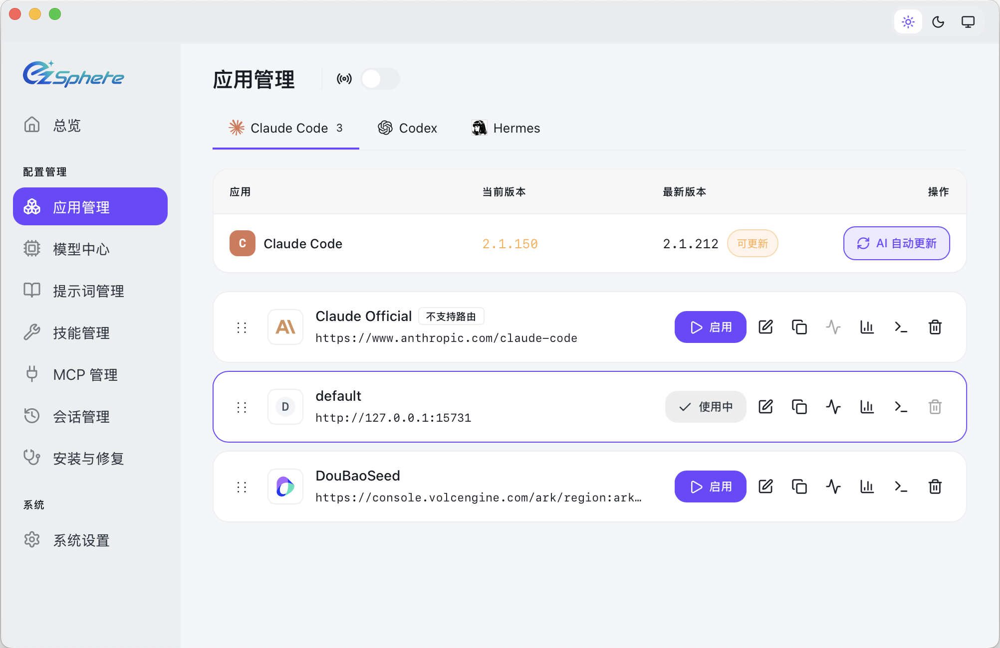

<div align="center">

# ezSphere

### Unified AI Tool Management — Configuration Switching, Deployment & Repair

[](https://github.com/yangbf1999/ezsphere/releases)
[](https://github.com/yangbf1999/ezsphere/releases)
[](https://tauri.app/)
[](https://github.com/yangbf1999/ezsphere/releases/latest)


### 🌐 Website: **https://github.com/yangbf1999/ezsphere**

English | [中文](README_ZH.md) | [日本語](README_JA.md) | [Deutsch](README_DE.md) | [Changelog](CHANGELOG.md)

</div>

## Why ezSphere?

Vibe Coding — human-AI collaborative programming — has become an irreversible trend.
Claude Code, Codex and Hermes are globally recognized as the most powerful coding tools,
completely transforming how software is built.
Yet these three tools face significant barriers in China and other markets:

- **Network barriers**: Some tools require access to overseas services, restricted on campus/corporate networks
- **Account barriers**: All require overseas credit cards or enterprise SSO, difficult for many users to obtain
- **Environment barriers**: Complex setup with long dependency chains (Node.js, Python, Docker, etc.),
often taking 1-3 days of troubleshooting to get a working environment

**CC-Switch** pioneered unified configuration management for AI coding tools —
supporting provider switching, API key management, proxy routing and config sync
for Claude Code, Codex and Hermes, quickly becoming essential for developers.
But CC-Switch only solved the "configuration" piece. The bigger pain points —
installation, deployment, repair — remained unsolved.
New employee onboarding, new semester labs, machine replacements — each environment setup means
downloading tools one by one, installing dependencies, configuring environment variables,
debugging network issues, resolving version conflicts...
days go by before real work or coursework can begin.

To compress this entire process from "days" to "minutes", we built ezSphere —
a deep fork of CC-Switch that adds three critical capabilities:

1. **Complete UI/UX overhaul** — Moving beyond CC-Switch's developer-centric CLI style,
redesigned for teachers, students, operations staff, and casual users.
Evolved from a "developer tool" to a "desktop app for everyone".
2. **One-click Vibe Coding tool installation** — Built-in AI-powered installation engine
for Claude Code, Codex and Hermes. Environment detection, dependency fetching, and version verification
are fully automated. Students and teachers with zero experience can have a complete AI coding environment in 5 minutes.
3. **Conversational AI installation & repair assistant** — When environment issues arise,
no more digging through docs, logs, or Stack Overflow.
Just ask in natural language within ezSphere — the AI assistant auto-diagnoses,
provides a fix, and executes it. Compress 1-2 days of troubleshooting into a coffee break.

In short: CC-Switch made AI tools "usable"; ezSphere makes AI coding
"easy to install, easy to use, easy to repair".
We stand on the shoulders of CC-Switch, connecting the last mile for Vibe Coding
in enterprises and universities worldwide.

**ezSphere** gives you a single desktop app to manage all supported AI tools. Instead of editing config files by hand, you get a visual interface to import providers with one click, switch between them instantly, with built-in domestic provider presets, unified MCP and Skills management, and system tray quick switching — all backed by a reliable SQLite database with atomic writes that protect your configs from corruption.

- **One App, Three Tools** — Manage Claude Code, Codex and Hermes from a single interface
- **No More Manual Editing** — Domestic mainstream provider presets including DeepSeek, Doubao, Zhipu GLM, Kimi etc.; just pick and switch
- **Unified MCP & Skills Management** — One panel to manage MCP servers and Skills across Claude, Codex and Hermes
- **System Tray Quick Switch** — Switch providers instantly from the tray menu, no need to open the full app
- **Cloud Sync** — Sync provider data across devices via Dropbox, OneDrive, iCloud, or WebDAV servers
- **Cross-Platform** — Native desktop app for Windows and macOS, built with Tauri 2
- **Built-in Utilities** — Includes various utilities for first-launch login confirmation, signature bypass, plugin extension sync, and more

## Screenshots



## Features

[Full Changelog](CHANGELOG.md)

### Provider Management

- **3 supported tools** — Claude Code, Codex, Hermes; copy your key and import with one click
- **Universal providers** — One config syncs to Claude Code, Codex and Hermes
- One-click switching, system tray quick access, drag-and-drop sorting, import/export

### Tool Installation & Repair

- **AI-powered automatic installation** — One-click installation of Claude Code, Codex, Hermes with automatic version detection and dependency resolution
- **Intelligent failure repair** — If installation fails, the built-in Agent automatically diagnoses and repairs, no manual troubleshooting needed
- **Version management** — Detect current versions, check for updates, one-click upgrade to the latest version

### Proxy & Failover

- **Local proxy with hot-switching** — Format conversion, auto-failover, circuit breaker, provider health monitoring, and request rectifier
- **App-level takeover** — Independently proxy Claude, Codex, down to individual providers

### MCP, Prompts & Skills

- **Unified MCP panel** — Manage MCP servers across Claude, Codex and Hermes
- **Prompts** — Markdown editor with cross-app sync (CLAUDE.md / AGENTS.md) and backfill protection
- **Skills** — One-click install from GitHub repos or ZIP files, custom repository management, with symlink and file copy support

### Usage & Cost Tracking

- **Usage dashboard** — Track spending, requests, and tokens with trend charts, detailed request logs, and custom per-model pricing

### Session Manager & Workspace

- Browse, search, and restore conversation history across supported session sources
- **Workspace editor**  — Edit agent files (AGENTS.md, SOUL.md, USER.md, IDENTITY.md, etc.) with Markdown preview

### System & Platform

- **Cloud sync** — Custom config directory (Dropbox, OneDrive, iCloud, NAS), WebDAV server and S3-compatible storage sync
- Dark / Light / System theme, auto-launch, auto-updater, atomic writes, auto-backups, i18n (zh/zh-TW/en/ja)

## FAQ

<details>
<summary><strong>Which AI tools does ezSphere support?</strong></summary>

ezSphere currently supports **three** AI coding tools:

| Tool | Description |
|---|---|
| **Claude Code** | Anthropic's agentic coding CLI — supports hot-switching provider data without restart |
| **Codex** | OpenAI's coding agent — supports multiple official account switching (Plus/Team) |
| **Hermes** | Open-source AI agent runner — supports multiple model backends |

Each tool has dedicated provider presets, MCP/Skills management, and configuration synchronization.
</details>

<details>
<summary><strong>Do I need to restart the terminal after switching providers?</strong></summary>

For most tools, yes — restart your terminal or the CLI tool for changes to take effect. The exception is **Claude Code**, which currently supports hot-switching of provider data without a restart.

</details>

<details>
<summary><strong>My plugin configuration disappeared after switching providers — what happened?</strong></summary>

ezSphere provides a "Shared Config Snippet" feature to pass common data (beyond API keys and endpoints) between providers. Go to "Edit Provider" → "Shared Config Panel" → click "Extract from Current Provider" to save all common data. When creating a new provider, check "Write Shared Config" (enabled by default) to include plugin data in the new provider. All your configuration items are preserved in the default provider imported when you first launched the app.

</details>

<details>
<summary><strong>macOS installation</strong></summary>

Download the DMG from the [Download & Installation](#download--installation) section above.

1. Open the `.dmg` file and drag ezSphere to Applications
2. If you see "ezSphere cannot be opened because the developer cannot be verified", run:

```bash
sudo xattr -r -d com.apple.quarantine /Applications/ezSphere.app/
```

3. Launch ezSphere from Applications or Spotlight

</details>

<details>
<summary><strong>Why can't I delete the currently active provider?</strong></summary>

ezSphere follows a "minimal intrusion" design principle — even if you uninstall the app, your CLI tools will continue to work normally. The system always keeps one active configuration, because deleting all configurations would make the corresponding CLI tool unusable. If you rarely use a specific CLI tool, you can hide it in Settings. To switch back to official login, see the next question.

</details>

<details>
<summary><strong>How do I switch back to official login?</strong></summary>

Add an official provider from the preset list. After switching to it, run the Log out / Log in flow, and then you can freely switch between the official provider and third-party providers. Codex supports switching between different official providers, making it easy to switch between multiple Plus or Team accounts.

</details>

<details>
<summary><strong>Where is my data stored?</strong></summary>

- **Database**: `~/.ezsphere/ezsphere.db` (SQLite — providers, MCP, prompts, skills)
- **Local settings**: `~/.ezsphere/settings.json` (device-level UI preferences)
- **Backups**: `~/.ezsphere/backups/` (auto-rotated, keeps 10 most recent)
- **Skills**: `~/.ezsphere/skills/` (symlinked to corresponding apps by default)
- **Skill Backups**: `~/.ezsphere/skill-backups/` (created automatically before uninstall, keeps 20 most recent)

</details>

## Quick Start

### Basic Usage

1. **Add Provider**: Go to "Model Center" page -> Choose a preset or create custom configuration
2. **Switch Provider**:
   - App Manager: Select provider -> Click "Enable"
   - System Tray: Click provider name directly (instant effect)
3. **Takes Effect**: Restart your terminal or the corresponding CLI tool to apply changes (Claude Code does not require a restart)
4. **Back to Official**: Add an "Official Login" preset, restart the CLI tool, then follow its login/OAuth flow

### MCP, Prompts, Skills & Sessions

- **MCP**: Go to "MCP Management" page, click "MCP" button -> Add servers via templates or custom config -> Toggle per-app sync
- **Prompts**: Go to "Prompts Management" page -> Create presets with Markdown editor -> Activate to sync to live files
- **Skills**: Go to "Skills Management" page -> Import skills from local -> One-click install to supported apps
- **Sessions**: Go to "Session Manager" page -> Browse, search, and restore conversation history across supported session sources

> **Note**: On first launch, you can manually import existing CLI tool configs as the default provider.

## Download & Installation

### System Requirements

- **Windows**: Windows 10 and above
- **macOS**: macOS 12 (Monterey) and above

### Windows Users

Download the latest installer:

- `ezSphere_1.0.0_x64-setup.exe` — [Download](https://github.com/yangbf1999/ezSphere/releases/download/v1.0.0/ezSphere_1.0.0_x64-setup.exe)
- `ezSphere_1.0.0_x64_en-US.msi` — [Download](https://github.com/yangbf1999/ezSphere/releases/download/v1.0.0/ezSphere_1.0.0_x64_en-US.msi)

### macOS Users

Download the latest DMG:

- `ezSphere_1.0.0_aarch64.dmg` (Apple Silicon) — [Download](https://github.com/yangbf1999/ezSphere/releases/download/v1.0.0/ezSphere_1.0.0_aarch64.dmg)
- `ezSphere_1.0.0_x86_64.dmg` (Intel) — [Download](https://github.com/yangbf1999/ezSphere/releases/download/v1.0.0/ezSphere_1.0.0_x86_64.dmg)

> **Note**: If you see "ezSphere cannot be opened because the developer cannot be verified", run:
> ```bash
> sudo xattr -r -d com.apple.quarantine /Applications/ezSphere.app/
> ```
<details>
<summary><strong>Architecture Overview</strong></summary>

### Design Principles

```
┌─────────────────────────────────────────────────────────────┐
│                    Frontend (React + TS)                    │
│  ┌─────────────┐  ┌──────────────┐  ┌──────────────────┐    │
│  │ Components  │  │    Hooks     │  │  TanStack Query  │    │
│  │   (UI)      │──│ (Bus. Logic) │──│   (Cache/Sync)   │    │
│  └─────────────┘  └──────────────┘  └──────────────────┘    │
└────────────────────────┬────────────────────────────────────┘
                         │ Tauri IPC
┌────────────────────────▼────────────────────────────────────┐
│                  Backend (Tauri + Rust)                     │
│  ┌─────────────┐  ┌──────────────┐  ┌──────────────────┐    │
│  │  Commands   │  │   Services   │  │  Models/Config   │    │
│  │ (API Layer) │──│ (Bus. Layer) │──│     (Data)       │    │
│  └─────────────┘  └──────────────┘  └──────────────────┘    │
└─────────────────────────────────────────────────────────────┘
```

**Core Design Patterns**

- **SSOT** (Single Source of Truth): All data stored in `~/.ezsphere/ezsphere.db` (SQLite)
- **Dual-layer Storage**: SQLite for syncable data, JSON for device-level settings
- **Dual-way Sync**: Write to live files on switch, backfill from live when editing active provider
- **Atomic Writes**: Temp file + rename pattern prevents config corruption
- **Concurrency Safe**: Mutex-protected database connection avoids race conditions
- **Layered Architecture**: Clear separation (Commands → Services → DAO → Database)

**Key Components**

- **ProviderService**: Provider CRUD, switching, backfill, sorting
- **McpService**: MCP server management, import/export, live file sync
- **ProxyService**: Local proxy mode with hot-switching and format conversion
- **SessionManager**: Conversation history browsing across supported session sources
- **ConfigService**: Config import/export, backup rotation
- **SpeedtestService**: API endpoint latency measurement

</details>

<details>
<summary><strong>Development Guide</strong></summary>

### Environment Requirements

- Node.js 22.12+
- pnpm (latest)
- Rust 1.95+
- Tauri CLI 2.8+

### Development Commands
```bash
# Install dependencies
pnpm install

# Dev mode (hot reload)
pnpm tauri dev

# Start frontend dev server only (renderer)
pnpm dev:renderer

# Build frontend only (renderer)
pnpm build:renderer

# Type check
pnpm typecheck

# Format code
pnpm format

# Check code format
pnpm format:check

# Run frontend unit tests
pnpm test:unit

# Watch mode (auto re-run on changes)
pnpm test:unit:watch

# Build application (production)
pnpm build

# Build debug version
pnpm tauri build --debug
```

### Rust Backend Development
```bash
cd src-tauri

# Format Rust code
cargo fmt

# Run clippy checks
cargo clippy

# Run all backend tests
cargo test --lib

# Run specific tests
cargo test test_name

# Run tests with test-hooks feature (for CI)
cargo test --features test-hooks

# Build debug version directly
cargo build
```

### Building

```bash
# Windows (NSIS installer)
pnpm tauri build --target x86_64-pc-windows-msvc

# macOS Apple Silicon
pnpm tauri build --target aarch64-apple-darwin

# macOS Intel
pnpm tauri build --target x86_64-apple-darwin

# Debug build
pnpm tauri build --debug
```

> **Note**: Building requires Rust 1.95+, Tauri CLI, and platform dependencies. See [DEV_HANDBOOK](./.specs/DEV_HANDBOOK.md) for detailed setup.

### Testing Guide

**Frontend Testing**:

- Uses **vitest** as test framework
- Uses **MSW (Mock Service Worker)** to mock Tauri API calls
- Uses **@testing-library/react** / **@testing-library/user-event** for component testing

**Running Tests**:

```bash
# Run all frontend tests
pnpm test:unit

# Watch mode (auto re-run on changes)
pnpm test:unit:watch

# Run all backend tests
cd src-tauri && cargo test --lib
```

### Tech Stack

**Frontend**: React 18 · TypeScript · Vite · TailwindCSS 3.4 · TanStack Query v5 · react-i18next · react-hook-form · zod · shadcn/ui · @dnd-kit · lucide-react

**Backend**: Tauri 2.8 · Rust · serde · tokio · reqwest · thiserror · tauri-plugin-updater/process/dialog/store/log/deep-link/window-state/single-instance

**Testing**: vitest · MSW · @testing-library/react · @testing-library/user-event
</details>

<details>
<summary><strong>Project Structure</strong></summary>

```
├── src/                          # Frontend (React + TypeScript)
│   ├── api/                      # Tauri IPC wrappers
│   ├── assets/                   # Static assets (fonts, icons)
│   ├── components/               # UI components
│   │   ├── agents/               # Agent prompt editor
│   │   ├── chat/                 # Chat UI components
│   │   ├── common/               # Shared UI components
│   │   ├── deeplink/             # Deep Link import UI
│   │   ├── env/                  # Environment variable editor
│   │   ├── hermes/               # Hermes config panels
│   │   ├── icons/                # Provider icon components
│   │   ├── mcp/                  # MCP management UI
│   │   ├── models/               # Model center
│   │   ├── prompts/              # Prompts management UI
│   │   ├── providers/            # Provider list/card/form
│   │   ├── proxy/                # Proxy & failover UI
│   │   ├── sessions/             # Session manager UI
│   │   ├── settings/             # Settings panels
│   │   ├── skills/               # Skills management UI
│   │   ├── ui/                   # shadcn/ui component library
│   │   ├── universal/            # Universal provider UI
│   │   ├── usage/                # Usage dashboard UI
│   │   └── workspace/            # Workspace editor UI
│   ├── config/                   # Preset configs (providers/mcp/prompts)
│   ├── contexts/                 # React contexts
│   ├── hooks/                    # Custom React hooks
│   ├── i18n/                     # Translations (locales)
│   ├── icons/                    # Extracted SVG icons
│   ├── layouts/                  # Shell/app layouts
│   ├── lib/                      # Core library
│   │   ├── api/                  # Type-safe API wrapper
│   │   ├── errors/               # Error utilities
│   │   ├── query/                # TanStack Query setup
│   │   ├── schemas/              # Form validation schemas
│   │   └── utils/                # UI utilities (cn, etc.)
│   ├── pages/                    # Page-level components
│   ├── stores/                   # Zustand stores
│   ├── types/                    # TypeScript definitions
│   └── utils/                    # Helper utilities
├── src-tauri/                    # Backend (Rust)
│   ├── src/
│   │   ├── commands/             # Tauri command layer (by domain)
│   │   ├── database/             # SQLite schema + DAO
│   │   │   └── dao/              # Data access objects
│   │   ├── deeplink/             # Deep Link parsing/handling
│   │   ├── deployment/           # AI install & repair (Agent chain)
│   │   ├── mcp/                  # MCP sync modules (per-app)
│   │   ├── proxy/                # Local proxy engine
│   │   │   ├── providers/        # Protocol converters (per-app)
│   │   │   └── usage/            # Usage tracking middleware
│   │   ├── resources/            # Bundled resources
│   │   ├── services/             # Business logic layer
│   │   │   ├── provider/         # Provider CRUD, live config
│   │   │   └── webdav_sync/      # WebDAV cloud sync
│   │   └── session_manager/      # Session history browsing
│   ├── tests/                    # Backend integration tests
│   └── Cargo.toml                # Rust dependencies
├── tests/                        # Frontend unit tests
├── assets/                       # Screenshots & partner banners
│   └── screenshots/              # Product screenshots
├── docs/                         # Documentation (api/ bundled assets)
├── flatpak/                      # Flatpak packaging config
├── scripts/                      # Build/release scripts
└── *.json / *.ts / *.cjs         # Config files (package, vite, tailwind, tsconfig)
```

</details>

## Contributing

Issues and suggestions are welcome!

Before submitting PRs, please ensure:

- Pass type check: `pnpm typecheck`
- Pass format check: `pnpm format:check`
- Pass unit tests: `pnpm test:unit`

For new features, please open an issue for discussion before submitting a PR. PRs for features that are not a good fit for the project may be closed.

## Acknowledgments

ezSphere builds upon the work of these excellent open-source projects:

- **[CC-Switch 3.16.4](https://github.com/farion1231/CC-Switch)** (MIT) - Configuration orchestration host; provider/proxy/database foundation

Heartfelt thanks to the authors and contributors of these projects! 🙏

## License

MIT © Jason Young
